# Munch

Munch is a social recipe blog website where users (Munchers) come together to share recipes with other users. As a user you can add, edit, delete, comment and like recipes.

The live link can be found here - [Munch]()

# User Experience (UX)

Munch is a website for all ages but specifically tailored to adults where they can explore different recipes and cuisines or share their own in a community of foodies also known as Munchers!

# User Stories 

## EPIC | Navigation
- As a User I can navigate around the site so that I can easily view desired content.
- As a User I can view a list of recipes so that I can select one to read.
- As a User I can select a recipe so that I can read the recipe details
- As a User I can search for recipes so that I can find specific recipes.

## EPIC | User's Recipes
- As a User I can create a recipe so that other Munch users can view them.
- As a User I can edit recipes so that I can update any changes or mistakes to my recipes.
- As a User I can delete recipes so that I can remove any submitted recipes.

## EPIC | User Interaction
- As a User I can like/unlike recipes so that I can mark my favourite recipes
- As a User I can view the number of likes on a recipe so that I can see which is most popular.
- As a User I can leave comments on a recipe so that I give feedback and opinions and feel involved in the conversation
- As a User I can view comments on recipes so that I can read other user's comments and be part of the conversation.

## EPIC | Sign in
- As a User I can register an account so that I can like/dislike, comment and upload recipes.
- As a User I can log in and out of my account so that I can control and manage my account

## EPIC | Admin
- As an Admin I can view, create, edit and delete all recipes and comments so that I can control the website's content.

# Design

The design of the app is based on the wireframes with a mix of another food blog called [iamafoodblog](https://iamafoodblog.com/) and Code Institutes 'I think therefore I Blog' project.   

## Colour Scheme
- The colour scheme for Munch is fairly simple, minimal and aesthetically pleasing. I used a very dark grey, white and some subtle hints of colour such as the red/maroon buttons to contrast the hero image on the home page. I went for this style as it is clean but also because it is versatile as it matches with most colours which is important as the site would complement the colours of the images uploaded by users, and keep the recipes the center of attention.

## Typography
- The font used on Munch is Dosis as it is a clear and easily readable font. It is also a unique and fun font which goes with the blog theme of the site.  

## Imagery
- All the images are based on food and where taken from this [site.](https://iamafoodblog.com/)

# Database Schema 

The design of the database can be seen below.

# Features

## Home Page

### Navigation bar
- The navigation bar is at the top of every page and contains the links to all the other pages.
- The current page is highlighted active to the user by bolder font. 
- Hovering over the nav links will brighten the font.
- The links to "Register" and "Log in" will change to "Log Out" once the user has logged in to their account.
- Once a user has logged in, more links will be displayed. The links that will be displayed are "Profile" which is a dropdown box which contains two options which are "Add Recipe" and "Liked Recipes".
- There is a search bar on the right side of the navbar so users can easily and quickly search for recipes.
- The navbar is fully responsive, collapsing into a hamburger menu when the screen size is small e.g. mobile. 

### Hero Image
- The hero image welcomes the user with the Munch catch line and tells the user to sign up to start Munching.
- There is a sign up button just below the message. Clicking the button will take the user to the register page.
- When a user is signed in the message changes to "Lets start Munching {Username}" and the sign up button changes to the recipes button which once clicked on takes the user to the recipes page. 

### About Us
- The about us section explains to the user a bit about the Munch website.
- It also shows the user that we cultivate an inclusive community.

### Features
- The features section displays three short messages stating some functionality of the Munch website next to images of food.

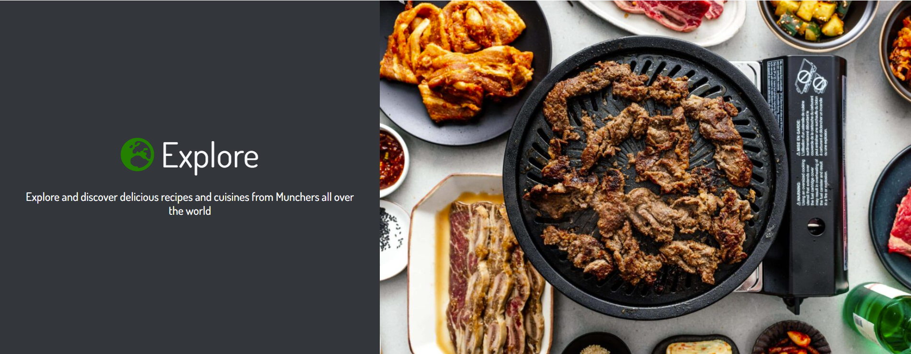

### Footer
- The footer rests at the bottom of each page and has links to all social media accounts.
- The footer also includes social media links so the user can see and connect with Munch and other Munchers. The links will open to a new tab to allow easy navigation for the user.

### Accounts

### Register Page
- The register page is used to create an account.
- The user enters a username, email(optional), password and a confirmation of the password.

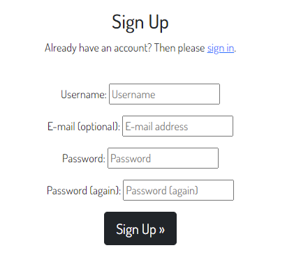

### Login Page
- The login page is used to log in users with an existing account.
- The user enters their username and password.
- A success message will appear once a user successfully logs in.

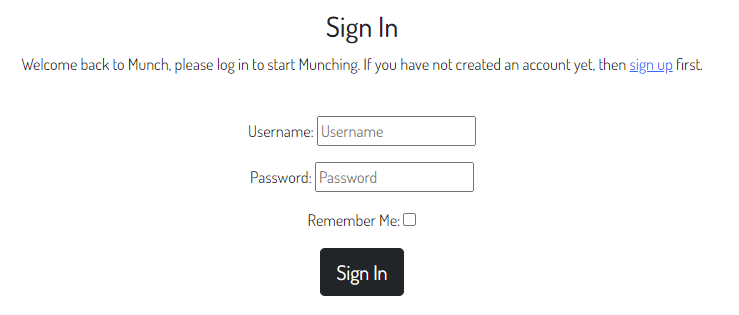

### Log out Page
- The log out page is used to log out users who are signed in.
- A success message will appear once a user successfully logs out.

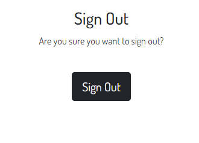

### Recipe Page

### Recipe Cards
- The site will paginate all recipe cards to display 6 for a page.
- Each card will display the recipe's image, Title, Author, Servings, Cook time, Description, Published date and how many likes it has received.
- Clicking anywhere inside the recipes card will take the user directly to that recipes detail page.
- The recipe cards are in a dark grey to match the websites theme as well as contrast the white background.
- The recipe cards also have a hover effect so the user can easily navigate through the recipes and see what recipe their cursor is currently on.

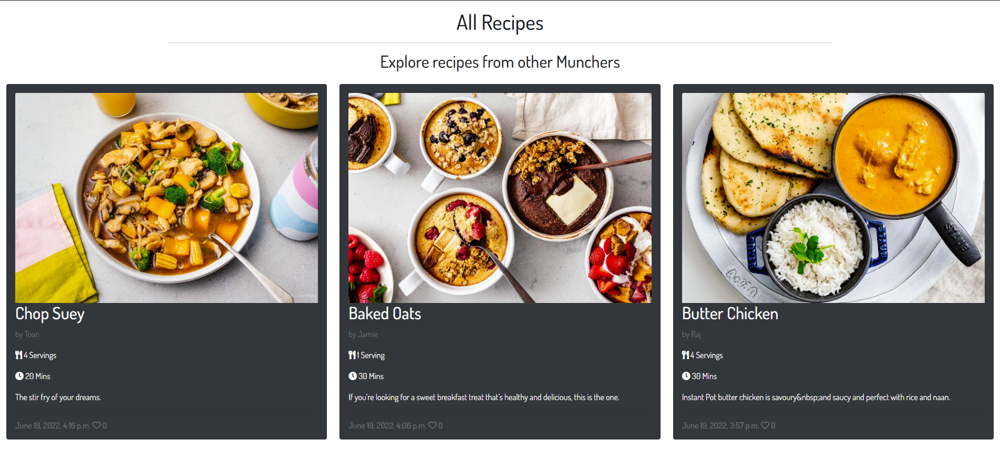

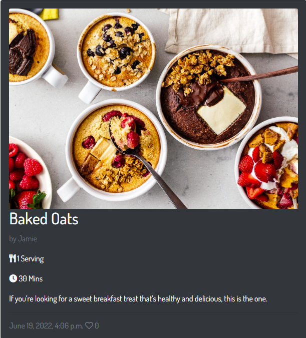

### Recipe Detail Page

### Recipe Feature
- At the top of the page the recipe feature shows the image, title, author and published date.
- If the user created that certain recipe they will see two additional buttons "edit" and "delete" which will take them to the edit recipe page and delete confirmation modal. 

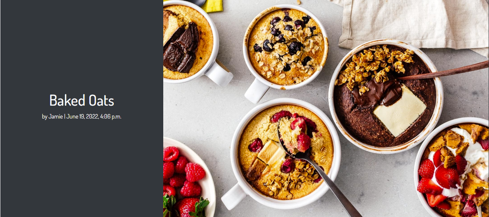

### If the recipe belongs to the user

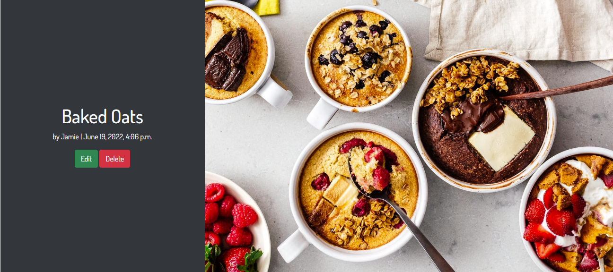

### Main Section
- The main body of the page consists of the description, ingredients, servings, cook time and method. These combined is what creates the whole recipe.
- At the bottom of the section is an icon and counter for both likes and comments.
- Clicking the outlined heart renders the recipe 'liked' by the user which will then fill in the heart, add 1 to the counter, and add the recipe to the users liked recipes page.
- Alternatively, clicking a filled in heart renders the recipe 'unliked' which will then change the heart back to an outline, reduce the counter by 1 and remove the recipe from the user's liked recipe page.

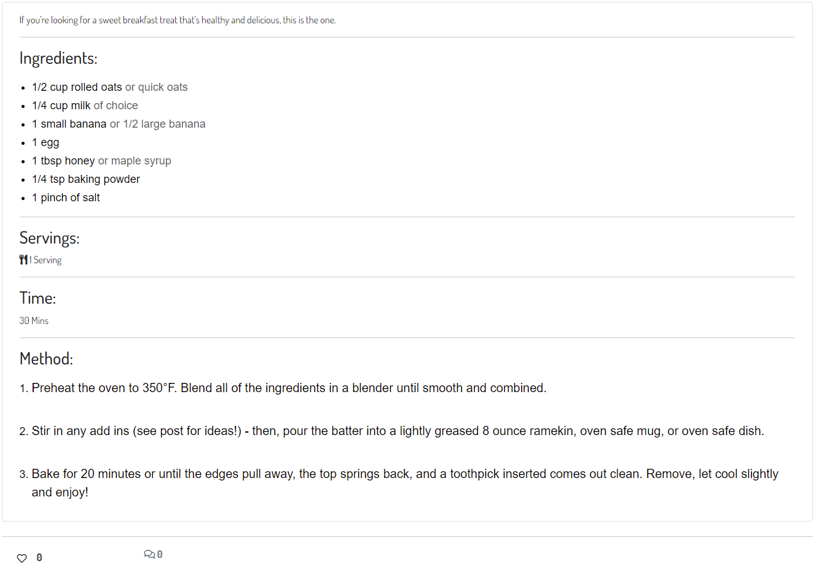

### Comments
- At the bottom of the page is the comment section. This is where users can view all comments left by themselves and other users.
- Only signed in users can leave a comment. 
- When a user posts a comment the comment counter increments by 1.

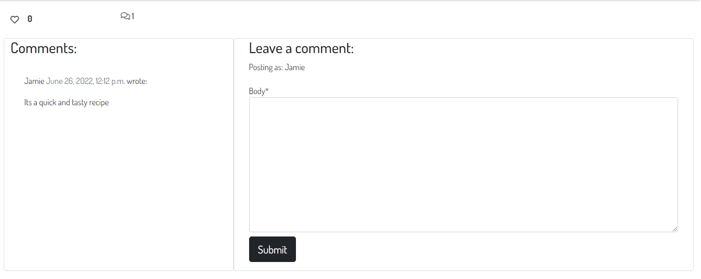

### Search Recipes Page

### Search Recipes
- Users can search for specific foods and recipes and all related recipes will be shown to the user.
- If a recipe or food is not found the user is presented with a message telling them to search again and/or view all the recipes (recipe page).

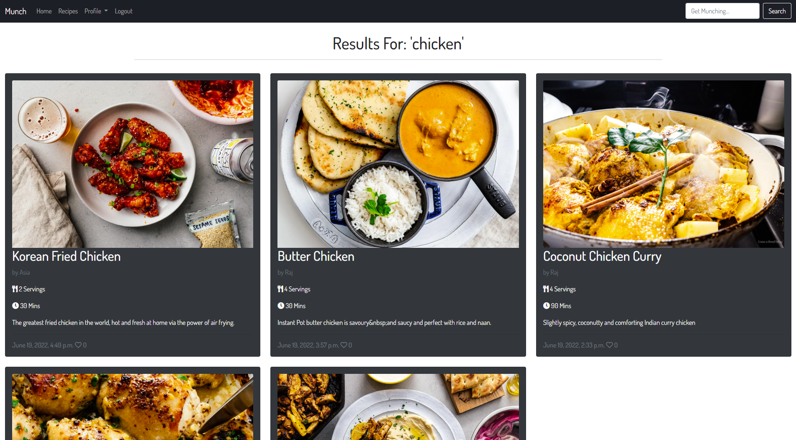

### If recipe is not found

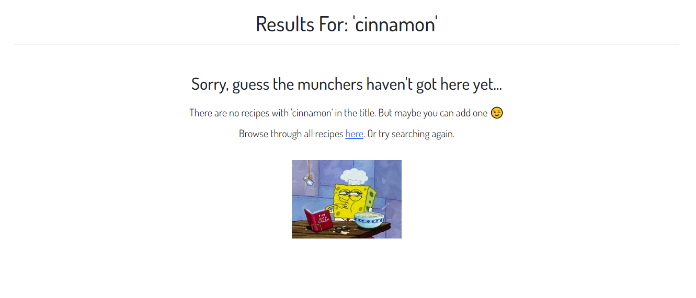

### Profile 
- When a user is logged in the profile dropdown menu will appear on the navbar.
- Within the profile dropdown menu their are two options which are "Add recipe" and "Liked recipes".
- The "Add recipe" will take the user to the add recipe page, where they can add a new recipe.
- The "Liked recipes" page takes the user to the liked recipes page, where they can view all the recipes they have liked.

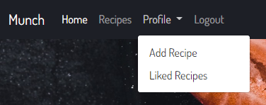

### Add Recipe Page

### Adding Recipes
- The add recipe page is where users upload their recipes.
- Each recipe is uploaded by filling out a form.
- The form uses summernote widgets.
- If the user fails to fill out either the recipes Title, Description, Ingredients, Servings, Cook time or Method, results in the form failing and rendering a message stating which fields the user has missed. 
- The user has two options to upload an image of their recipe. They can either choose a file to upload or insert the URL address of the image. 
- If neither of the image options are used a default image will be generated.
- An add Recipe button is present at the bottom of the page once the form is ready to send.
- A success message appears once a recipe is added successfully.  

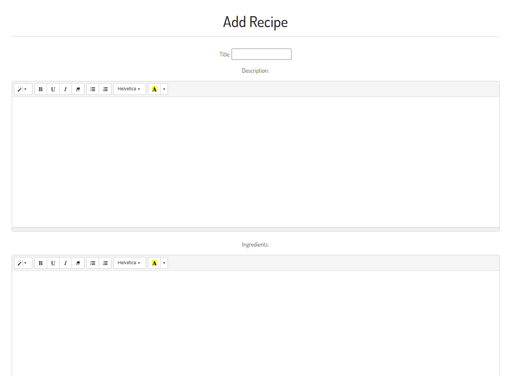

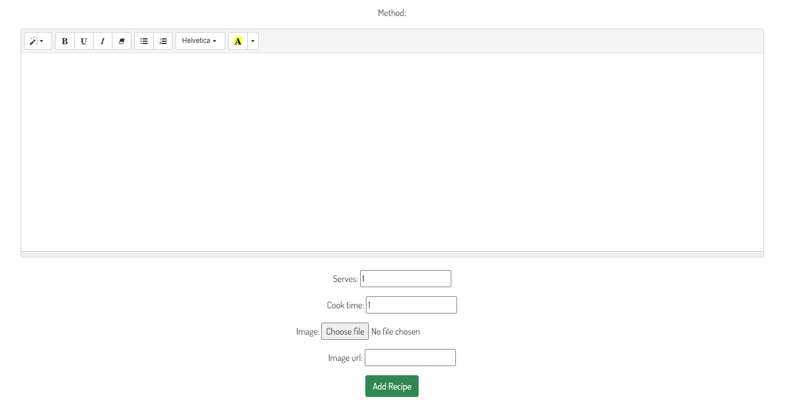

### Liked Recipes Page

### Liked Recipes
- This page shows recipes that the user has liked.

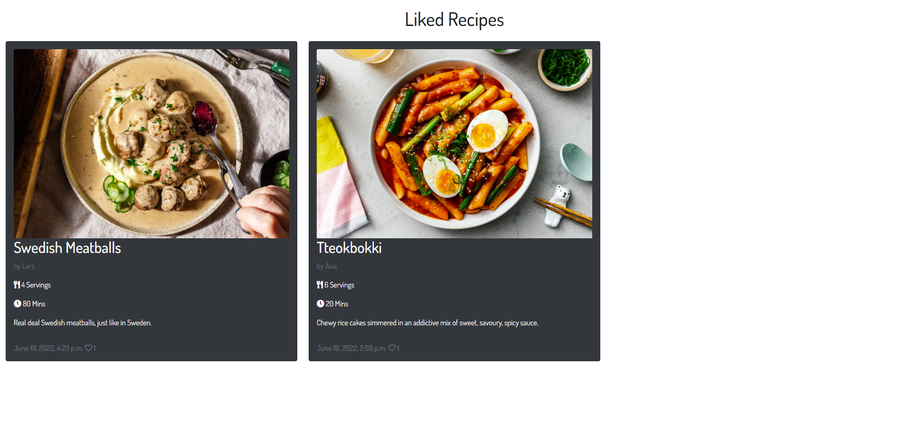

### Edit Recipe Page

### Editing Recipes
- Editing a recipe brings up the form that was filled in when the user created the recipe and contains all the fields filled in with the original content.
- Changing the content and clicking the "edit recipe" button at the bottom of the page saves the recipe.

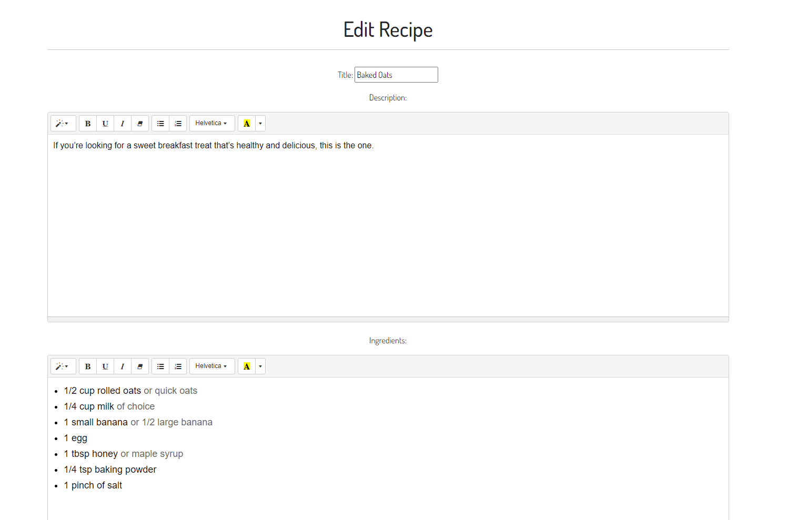

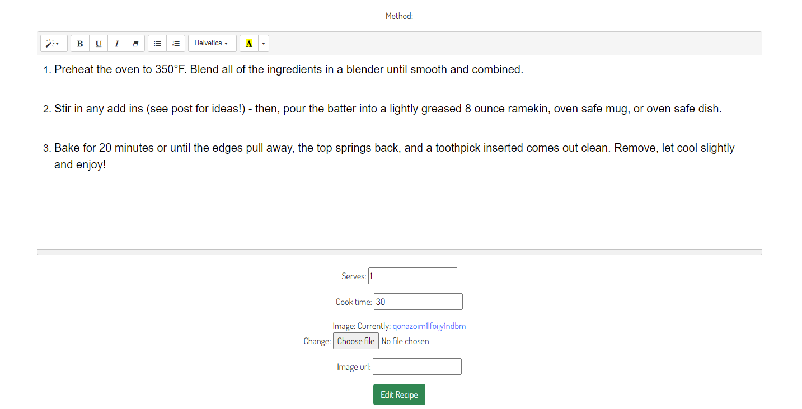

## Features left to implement
*There are no features left to implement from the initial scope of my project, however I have some features that I would like to add in the future.*

- A search filter to filter through different categories such as food type (Breakfast, Dessert etc), popularity etc. 
- A top recipes feature to dynamically show the top recipes.
- Option to share recipes on social media.

# Technologies

## Languages used

- [HTML5](https://en.wikipedia.org/wiki/HTML5)
- [CSS3](https://en.wikipedia.org/wiki/Cascading_Style_Sheets)
- [Javascript](https://en.wikipedia.org/wiki/JavaScript)
- [Python](https://www.python.org/)

## Libraries and Programs Used

- [Git](https://git-scm.com/)
    - Version control.
- [GitHub](https://github.com/)
    - For storing code and deploying the site.
- [Gitpod](https://www.gitpod.io/)
    - Used for building and editing my code.
- [Django](https://www.djangoproject.com/)
    - A python based framework that was used to develop the site.
- [Bootstrap](https://getbootstrap.com/)
    - For help designing the html templates.
- [Google Fonts](https://fonts.google.com/)
    - Used to style the website's text.
- [Font Awesome](https://fontawesome.com/)
    - Used to obtain the icons used.
- [Google Developer Tools](https://developers.google.com/web/tools/chrome-devtools)
    - Used to help fix problem areas and identify bugs.
- [Cloudinary](https://cloudinary.com/)
    - Used to store static files and images.
- [Favicon.io](https://favicon.io/)
    - Used to generate the site's favicon.
- [PostgreSQL](https://www.postgresql.org/)
    - Database used through heroku.
- [LucidChart](https://www.lucidchart.com/pages/)
    - To draw the database schema.
- [Summernote](https://summernote.org/)
    - Used to add a WYSIWYG text box to the add recipe page.
- [Heroku](https://www.heroku.com/)
    - To deploy the project.